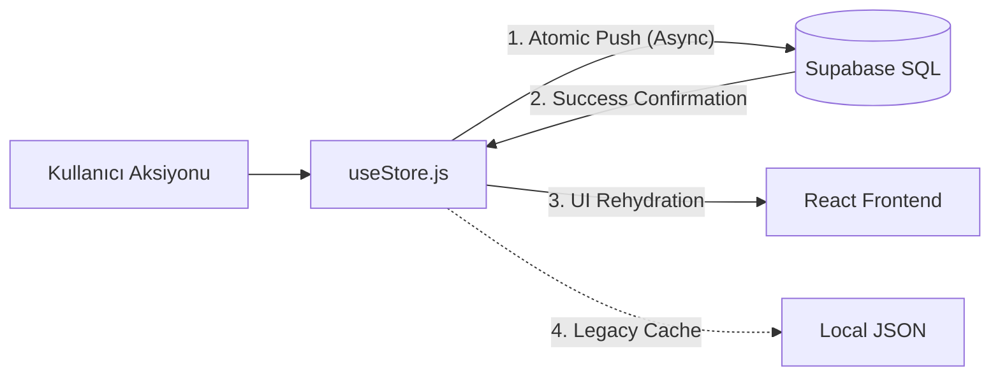

# 🏛️ Eraylar Hanem 2. Milat: Yeni Dünya Düzeni (%100 SQL SSOT)

Bu doküman, projenin monolitik JSON yapısından tamamen kurtulup, saf bir SQL mimarisine geçtiği nihai durumu temsil eder. Artık projenin tek bir gerçeği (SSOT) vardır: **Supabase SQL.**

## 📊 Tek Bakışta Veri Mimarisi (One-View)

| Modül | Veri Kaynağı (SQL Tablosu) | SSOT Durumu |
| :--- | :--- | :--- |
| **FİNANS** | `finans_harcamalar`, `finans_kartlar`, `finans_ayarlar` | ✅ %100 SQL |
| **KASA** | `kasa_bakiyeler`, `kasa_ayarlar`, `kasa_kumbaralar` | ✅ %100 SQL |
| **MUTFAK** | `mutfak_stok`, `mutfak_tarifler`, `mutfak_sohbet` | ✅ %100 SQL |
| **TATİL** | `tatil_seyahatler`, `tatil_belgeler` | ✅ %100 SQL |
| **SAĞLIK** | `saglik_olcumler`, `saglik_ayarlar` | ✅ %100 SQL |
| **SOSYAL** | `sosyal_etkinlikler`, `sosyal_rutinler` | ✅ %100 SQL |
| **GARAJ/PET** | `garaj_kayitlar`, `pet_takip` | ✅ %100 SQL |
| **SİSTEM** | `eraylar_store` (Sadece Metadata) | ⚙️ Metadata Only |

## 🔄 Mimari Akış (Atomic SSOT)

## 📜 Yeni Anayasa Prensipleri

1. **SQL Otoritedir:** Hiçbir lokal veri (JSON/Cache) SQL'den gelen veriyi ezemez.
2. **Atomicity:** Her `push` işlemi bir `async/await` bariyeridir; veritabanı "OK" demeden UI güncellenmez.
3. **Mükerrerlik Yasaktır:** Harcama, Tatil ve Hedeflerde aynı isimli kayıtlar sistem tarafından otomatik engellenir.
4. **Smart Fetch:** Uygulama açılışında tüm modüller doğrudan kendi SQL tablolarından beslenir (`fetchPhase3Data`).

---
*Bu yapı, Eraylar Hanem'in artık ölçeklenebilir, güvenli ve profesyonel bir yazılım olduğunu tesciller.* 🛡️🏦✨
