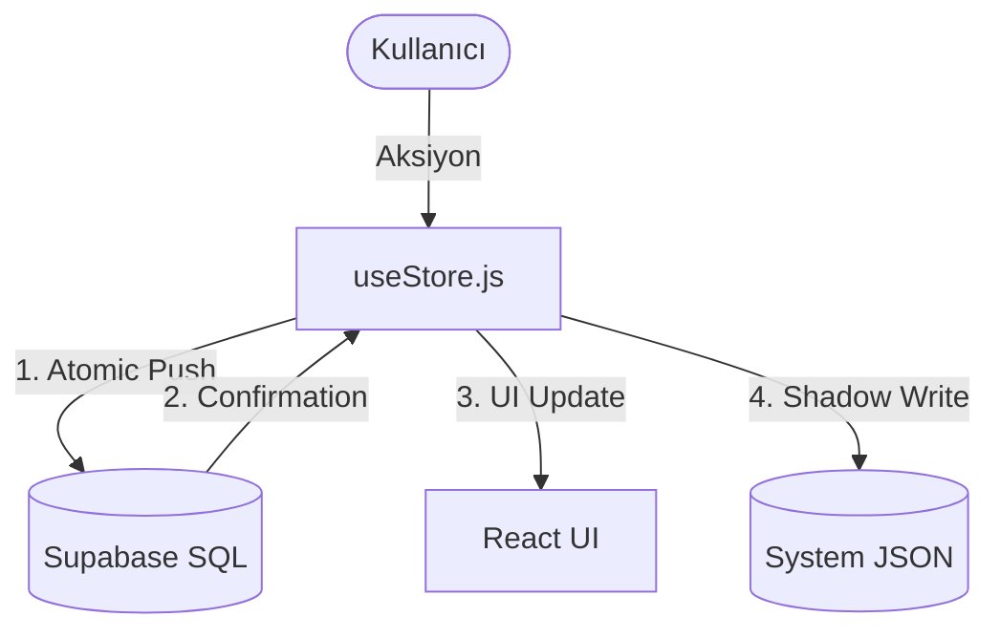

# Decision: Teknik Mimari (2. Milat) 🏛️📊

Bu doküman, uygulamanın teknik altyapısını, dosya yapısını ve %100 SQL tabanlı SSOT yapısını açıklar.

## 🛠️ Teknoloji Yığını
- **Frontend:** React (Vite)
- **State Yönetimi:** Zustand (Merkezi Store)
- **Veritabanı:** Supabase (PostgreSQL)
- **Styling:** Vanilla CSS

## 🔄 Gerçek Zamanlı Senkronizasyon (Realtime Sync)
Eraylar Hanem, aile bireyleri arasında anlık veri paylaşımını sağlamak için **Supabase Realtime** mekanizmasını kullanır:
1. **Supabase Channel:** `subscribeToSupabase` fonksiyonu ile veritabanı değişiklikleri dinlenir.
2. **Anlık Güncelleme:** Bir cihazda yapılan değişiklik (Harcama, Mutfak notu vb.) diğer cihazlarda sayfa yenilemeden anında görünür.
3. **Optimistic UI:** Kullanıcı bir işlem yaptığında UI anında tepki verir, senkronizasyon arka planda tamamlanır.

## 🗄️ SQL Tablo Yapısı (Supabase SSOT)
Tüm domain verileri bağımsız tablolarda saklanır. JSON alanı (`eraylar_store`) sadece sistem metadata'sı için kullanılır.

### 1. Finans & Kasa 💳💰
- `finans_harcamalar`, `finans_kartlar`, `finans_krediler`, `kasa_bakiyeler`.

### 2. Mutfak & Stok 🍏
- `mutfak_stok`, `mutfak_tarifler`, `mutfak_menu`.

### 3. Diğer Modüller ✈️🩺
- `tatil_seyahatler`, `saglik_olcumler`, `hedefler`.

## 🔄 Veri Akış Diyagramı (SSOT)

